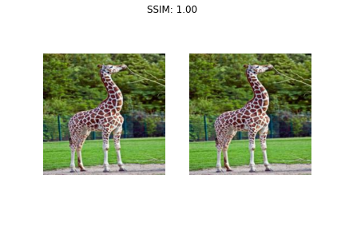
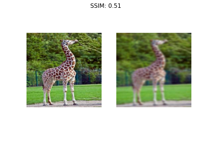
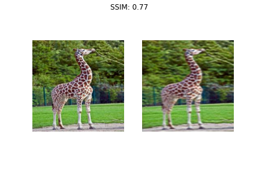
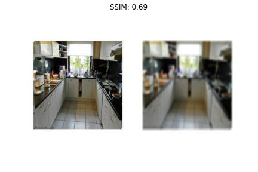
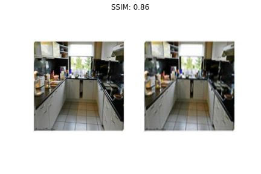
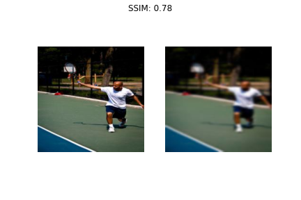
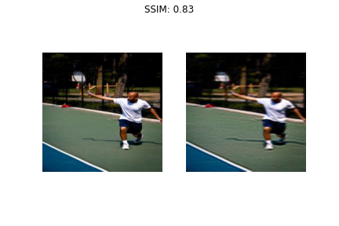

# Reconstruction of Blurred Images

### A brief implementation of the paper [Image Super Resolution Using Deep Convolutional Networks](https://arxiv.org/abs/1501.00092)

# Model Evaluation

### Loss Plot 

### SSIM Plot

### Sharpness Plot

# Results - 1

### Original vs Original

### Original vs Fully Blurred

### Original vs After Epoch 50

# Results - 2

### Original vs Original

### Original vs Fully Blurred

### Original vs After Epoch 50

# Results - 3

### Original vs Fully Blurred

### Original vs After Epoch 50

